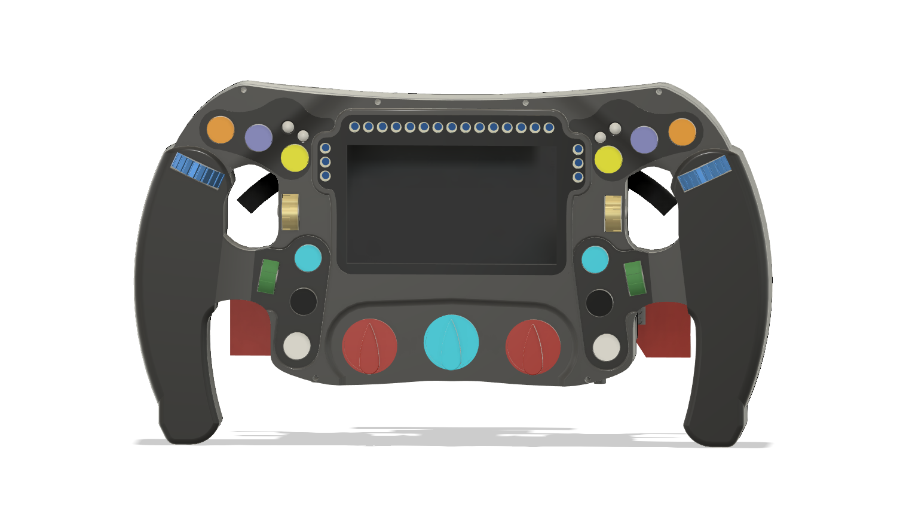

# Custom Simracing FFB Wheel

Hi! This is a custom-made Force Feedback Simracing steering wheel, made to somewhat resemble the 2019 Mercedes AMG F1 steering wheel, although not a direct replica. It is made using a hoverboard motor to save costs, and has a screen on the controller for the true F1 experience. For those who may not know what Force Feedback is, it's the usage of a motor to resist the motion of the player, to more closely mimic racecar steering, as the steering column in a racecar offers significant resistance to the driver. Generally this results in higher steering accuracy as humans are very good at gauging pressure accurately compared to distance, so resistance from a wheel helps with that. The wheel itself has a lot of buttons, as does every F1 steering wheel, to allow the driver to enable functions like pit lane steering limiter, etc. I am using keyswitches for a nice shifter experience, and a rotary encoder clutch pedal.

The premade setups you can get at this pricepoint do not offer the same selection of button and screen, and are lacking in torque (Often 2-3 Nm), so that made me want to make a much more capable wheel. There is significant complexity as the hub, wheel, and quickconnect all have to be designed. Overall I am a simracing fan and have always wanted to have a setup like this, but have been outpriced by the $700+ market rates, and figured this could be a great way to use my cad and pcb experience.

## Software

I intend to use a mix of the OpenFFBoard project's software (https://github.com/Ultrawipf/OpenFFBoard) and a small custom serial interface for the buttons and clutch pedal. As such this means you will plug in two USB cables to the computer, one for the wheel control and one for the buttons and clutch and display controller.

## Wiring Diagram

This is the full wiring diagram, the display unit will have 2 PCBs hooked up to it for the RPM status lights, and one to hold the shifter keyswitches (which is apart of buttons), as visible in the cad. All of the PCB design files can be found in the [kicad_project](./kicad_project/) folder. Here are the schematics and routing as images for sake of convinience however.

As to not spam this upper section with images, please check the [pcb images section](#pcb-images)

## CAD

All of the CAD was done in fusion 360, and while I *could* export my whole workspace, for the sake of sanity I uploaded the full assembly and just the wheel as two seperate files, the full assembly containing the wheel. Credit to GrabCAD for providing the models for some standard COTS parts (EG. ESP32, Power Supply, Magnetic Encoder Board, etc.).

## BOM

|Name                                                                |Price |Qty  |Expenditure|FIELD5|Link                                                                                                                                             |Notes:                                                |
|--------------------------------------------------------------------|------|-----|-----------|------|-------------------------------------------------------------------------------------------------------------------------------------------------|------------------------------------------------------|
|Hoverboard                                                          |$50   |1    |$50        |      |https://www.ebay.com/itm/316843156432                                                                                                            |                                                      |
|Ballbearings                                                        |$5.45 |1    |$5.45      |      |https://www.amazon.com/0-236-Precision-Chrome-Steel-Bearing/dp/B07L8MLK2N/                                                                       |                                                      |
|Springs                                                             |$5.30 |1    |$5.30      |      |https://www.amazon.com/uxcell-Compression-Spring-Stainless-Length/dp/B0C33CQ5LN/                                                                 |                                                      |
|Tactile Switch Buttons 12mm                                         |$0.06 |20   |$1.11      |      |https://lcsc.com/product-detail/Tactile-Switches_Megastar-ZX-QC1212-7-5CJ_C7470190.html?s_z=n_12mm%2520button                                    |                                                      |
|Rotary Encoder                                                      |$1.77 |12   |$21.24     |      |https://www.digikey.com/en/products/detail/bourns-inc/PEC11R-4225F-S0024/4499659                                                                 |Not in stock on LCSC, no similar models instock either|
|Neopixel Indiv                                                      |$4.95 |1    |$4.95      |      |https://www.adafruit.com/product/1938                                                                                                            |Only adafruit has in stock and/or sells :(            |
|WS2812B                                                             |$0.05 |30   |$1.47      |      |https://lcsc.com/product-detail/RGB-LEDs-Built-in-IC_XINGLIGHT-XL-5050RGBC-WS2812B_C2843785.html?s_z=n_ws2812b                                   |                                                      |
|470 Resistor                                                        |$0.00 |100  |$0.19      |      |https://lcsc.com/product-detail/Chip-Resistor-Surface-Mount_YAGEO-RC0805FR-0710KL_C84376.html?s_z=n_0805%2520470%2520ohm                         |                                                      |
|0.1uF Cap                                                           |$0.00 |100  |$0.46      |      |https://lcsc.com/product-detail/Multilayer-Ceramic-Capacitors-MLCC-SMD-SMT_YAGEO-CC0805KRX7R9BB104_C49678.html?s_z=n_capacitor%25200805%25200.1uF|                                                      |
|MX Blue                                                             |$1.25 |2    |$2.50      |      |https://www.digikey.com/en/products/detail/cherry-americas-llc/MX1A-E1NN/40084                                                                   |Not in stock on LCSC, no similar models instock either|
|M3 Screw Assortment                                                 |$9.99 |1    |$9.99      |      |https://www.amazon.com/Assortment-Stainless-Replacement-Machine-Fastener/dp/B0BMQFHDBH/                                                          |                                                      |
|M5 Screw + Nuts                                                     |$9.99 |1    |$9.99      |      |https://www.amazon.com/Assortment-Machine-Stainless-Washers-Threaded/dp/B0DFWW9DZK/                                                              |                                                      |
|4.3"LCD HDMI VGA,Video AV Driver Controller Board,TFT Module Display|$26.79|1    |$26.79     |      |https://www.buydisplay.com/4-3-lcd-hdmi-vga-video-av-driver-controller-board-tft-module-display                                                  |                                                      |
|Carbon Fibre Sticker Wrap                                           |$6.76 |1    |$6.76      |      |https://www.aliexpress.us/item/2251832843233677.html                                                                                             |                                                      |
|PCB                                                                 |$15   |1    |$15        |      |JLCPCB Cart                                                                                                                                      |                                                      |
|SK16 Linear Shaft Holders 4x                                        |$1.18 |1    |$1.18      |      |https://www.aliexpress.us/item/2255801037008492.html                                                                                             |                                                      |
|SK16 Linear Shaft Holders 2x                                        |$0.99 |1    |$0.99      |      |https://www.aliexpress.us/item/3256803971216207.html                                                                                             |                                                      |
|16mm Shaft                                                          |$7.59 |1    |$7.59      |      |https://www.amazon.com/uxcell-Linear-Hardened-Printer-Machine/dp/B0F32ZJCFC                                                                      |                                                      |
|MT6701 + Magnet                                                     |$0.99 |1    |$0.99      |      |https://www.aliexpress.us/item/3256808951558543.html                                                                                             |                                                      |
|OpenFFBoard                                                         |$34   |1    |$34        |      |https://www.elecrow.com/open-ffboard-stm32f407-usb-interface-only.html                                                                           |                                                      |
|96mm Fan                                                            |$8.67 |1    |$8.67      |      |https://www.digikey.com/en/products/detail/sunon-fans/MF92252V2-1000U-A99/7652235                                                                |Much to my awe, digikey has it for the cheapest?      |
|ODesc 4.2                                                           |$28.99|1    |$28.99     |      |https://flipsky.net/products/odesc-v4-2-24v-56v-controller                                                                                       |                                                      |
|600W PSU                                                            |$29.99|1    |$29.99     |      |https://www.amazon.com/BOSYTRO-Switching-Universal-Regulated-Security/dp/B0C53SLDM9/                                                             |                                                      |
|C14 Connector                                                       |$5.11 |1    |$5.11      |      |https://www.digikey.com/en/products/detail/te-connectivity-corcom-filters/1-6609987-4/1306112                                                    |                                                      |
|USBC Extension                                                      |$2    |1    |$2         |      |https://www.walmart.com/ip/onn-USB-C-Extension-Cable-White-6/153042914                                                                           |                                                      |
|XT90                                                                |11.99 |1    |11.99      |      |https://www.amazon.com/Female-Connector-Silicon-RC-Battery/dp/B08L3RS5HP/                                                                        |                                                      |
|12V Step-Down                                                       |8.99  |1    |8.99       |      |https://www.amazon.com/VOLRANTISE-Converter-Voltage-Regulator-Transformer/dp/B09WZ5WH8H?th=1                                                     |                                                      |
|VGA Connector                                                       |9.99  |1    |9.99       |      |https://www.amazon.com/uxcell-Connector-Terminal-Mechanical-Equipment/dp/B07LCM71MY/                                                             |                                                      |
|VGA Cable                                                           |5.28  |1    |5.28       |      |https://www.amazon.com/Pasow-Monitor-Cable-Computer-Projector/dp/B08B64KM93/                                                                     |                                                      |
|ESP32                                                               |12.99 |1    |12.99      |      |https://www.amazon.com/Development-ESP-WROOM-32-Bluetooth-Microcontroller-Compatible/dp/B0DSZTZKLM/                                              |                                                      |
|                                                                    |      |Total|**$330**       |      |Willing to incur any extra expense to myself                                                                                                     |                                                      |

## PCB Images

**Top Lights PCB**
 

**Safety Lights PCB**
 

**Shifter PCB**
 
