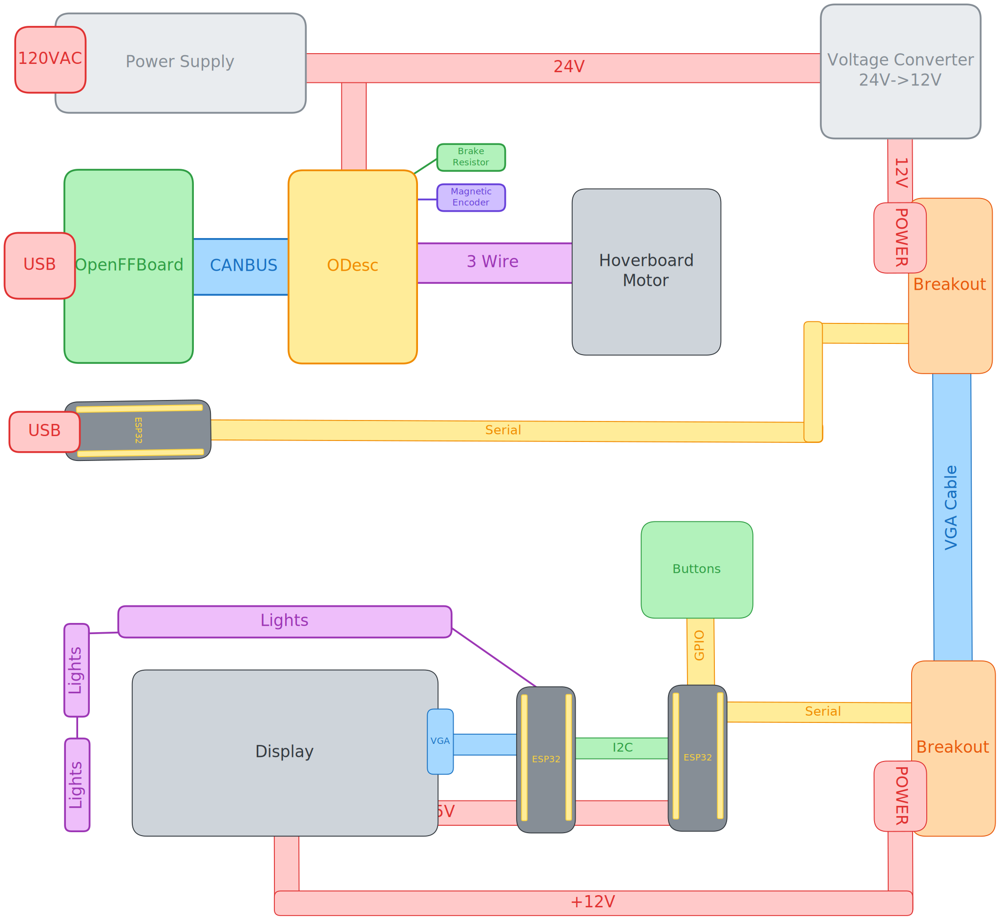

# Force Feedback Simracing Steering Wheel

**Total Time**: 57.5 Hours

---

Hello there, I am making a Force Feedback Steering wheel to fuel my sim racing addiction. Before I get started, you might be wondering what a "Force Feedback Steering Wheel" even is.

Normally when you turn the steering wheel in a car (even with power steering), you will feel some back force when you turn the wheel. This comes from the friction between the tires and the ground as you turn them. While this friction remains relatively the same on a given surface in a consumer car, this is not the case for racing cars.

Racing cars often use hydraulic power steering instead of electric power steering, which means you directly feel the interaction with the ground. So from how much the steering wheel resists your turning, it is reasonable for an experienced driver to deduce what surface they are on without even looking.

For Formula and Indycars, there is a concept called downforce. Downforce is the amount of force your car is pushed into the ground with. From a basic definition of friction, the more downforce (hence more normal force), the more friction between the tires and the surface. This changes the  way the steering wheel feels significantly.

When we sim race, our goal is to be able to accurately simulate the experience of being a real racecar. This can be achieved by using something called Force Feedback, where a motor attached to the steering wheel resists the motion of the wheel in order to simulate the forces you would feel in a real car.

----

*June 6th, 2025*

**Goals**:
 * Define design constraints and goals
 * Evaluate component choices
 * Possibly get started on a bit of the structural CAD

**Design Constraints**:
 * Ideally be under $350
 * Use components that ship quickly
 * Buildable in a less than 2 week timeframe
 * Is done in a safe manner (I should be confident in leaving this plugged in overnight without issue)

With this in mind, I will now move onto component choices.

In terms of the actual motor for FFB, I believe a hoverboard motor is the best option, this is largely due to its low price for being able to do nearly 15 Nm of torque. This will probably be a dumpster find or ebay find.

<i>A hoverboard hub motor</i>

The rest of the parts for the base are largely low cost minutia, mostly 3D printed or standard hardware. However, I do want to use a quick-connect steering hub adapter. This allows for me to switch between wheels, but also requires me to devise a mechanism to quick-disconnect the screen and button cable. That however is a problem for another day. 

In terms of the screen however, I think a 3.5" LCD best suits the f1 style wheel I want. Buttons and switches are fairly COTS components that are easy to find at low cost.

<i>A SPI display similar to the one I want to use, they come really cheap</i>

There are some electronic design choices that need to be made, but due to lack of time I will likely do that later.

**Time Spent: 4h**

---

*June 7th, 2025*

One thing this steering wheel needs is a quick connect mechanism. This quick-connect mechanism is what connects the steering wheel to the driver shaft in a manner that can be easily removed. This is very common in racecars and will allow me to easily swap out the wheel later. It will need some 6mm ball bearings for the latch mechanism.

The way it works is a bit convoluted, but in a simple manner there are ball bearings that are pushed in a locking groove, and retracting a collar releases these ball bearings, unlocking the steering wheel and allowing for its removal.

<i>A quick connect mechanism similar to what I plan on making</i>

This should be a fairly normal CAD job, however I decided to externalise the cable. While I could integrate data line for the buttons into the connector, I figured that this would be much more of a pain than having an uber long cable. 

Going into fusion, I designed both the male and female parts, lest the collar due to lack of time today.

**Time Spent: 4h**

---

*June 8th, 2025*

It has come time to finish the full quick-connect assembly. I designed the retaining collar today. This keeps the 6mm ball bearings that lock in the wheel in place. Using spring tension, it will hold the bearings with a step, and then the bearings will release when pushed in the back position. The springs used are 6mm diameter wtih 15mm length.

You can see the little step on the inside, indicating the portion of the collar where the ballbearings are secured in.

I then put it togheter in a final assembly with the ballbearings and the springs, composing the entire quick connect with some colorTM

This is the full quick connect assembly, so I will move onto the wheel tomorrow

**Time Spend: 2.5h**

---
*June 11th, 2025*

Now, I must get started on the wheel. I am planning on making a clone of the Mercedes F1 Wheel (pictured below). I like the open grip design a lot compared to the closed grip designs that other teams have. 

For the sake of my own sanity, I will probably omit some of the geometry but I aim to make all the buttons functional, which will be an undertaking to say the least. In terms of electronics, the lights are 5mm diameter so something like the Adafruit 5mm neopixels will work great. To avoid a severe case of overscoping, I will not make the knobs function except the center 3 as I really do not use them.

I actually looked up the dimensioning for the wheel to find nothing, and it turns out it is a 4.3 inch display. I will change to using a 4.3 inch SPI display at this point due to this discrepancy with my earlier estimate. I spent the day sketching out the major features of the wheel, I will deal with the actual modelling tommorow. 

You may notice some of the geometry is not mirrored, I gave up mirroring halfway through and figured I can just mirror once we are in the realm of 3d, saving me plenty time.

**Time Spent: 2h**

---
*June 16th, 2025*

Oooh boy its been a long day. I decided to just sit down and get a lot done. The entire front shell of the controller has been completed and partially the back shell. 

The front shell with buttons and rollers is completed, knobs are pending for the time being. One of the things I did do was do the curve geometry for part of the back shell, so now I can get the chance to work on the shifter piece and mounting mech. The largest part left is hollowing pieces so I can fit in electronics, and making a mounting piece.

Just a back view

In terms of electronics, it looks like we're gonna be in for a wild ride. I want to make a custom PCB just for the LED strips since I *really* do not want to be dealing in terms of individual LED wiring (and I want to use neopixels), besides that I want to use perfboard since space is not of the greatest concern. In terms of the MCU on the inside, I remain unsure. I think using an esp32 for all of this is probably my best bet however, if not a PI 0 (cooling go die).

Keeping power delivery in mind, I think I'm better off with the esp32 since I want data and power on the same coiled cable.

**Time Spend: 10h**

---
*June 17th, 2025*

I'm gonna take a break from CAD for a bit since it has been exhausting me, and look at electronics for a second

The goal today is to make the neopixel strip at the top, similar to https://www.adafruit.com/product/2869#technical-details 

The idea is to make a compact PCB that can be hand-soldered. Here is a schematic of what i'm thinking.

This is what the routing looks like, it is two sided to make it as compact as possible. I am happy with how compact I got it to be.

I also made a small version for the safety lights on either side

Now, I will integrate this into the actual frame of screen in CAD. The PCB has m3 screw holes for this mounting reason

I probably want to use a LCD Display like this https://www.amazon.com/Waveshare-4-3inch-Capacitive-Microcontroller-Dual-Core/dp/B0CTG8LZ6Z/, it has dedicated control which is needed as one esp32 can't handle button inputs and display. I will likely link this with the control board using something like i2c.

No official word, but this probably mounts with m3 screws or something of the sort, realistically this is just a make a box that fits and use hot glue job. 

**Time Spend: 6h**

---
*June 20th, 2025*

Today, I finished embedding the buttons and encoders into the front panel. For encoders I decided to use the https://www.adafruit.com/product/377 (found cheaper on digikey listed as PEC11R-4215F-S0024). These things are small yet cheap which is a hard balance to find with rotary encoders. I have heard good things too about the tactile feel. Seems like a no-brainer. (I need to cut a few mm off the shaft, but SHHHH)

One thing I will do is hot glue in plain neopixel LEDs (the 5mm kind, can be found at https://www.adafruit.com/product/1938) for the two status indicators near the top of the controller.

I am using 12mm tactile buttons for the clicks, they are extremely cheap and just work.

Here is what the mounting looks like 

Now, I am onto finishing the controller itself with the shift paddle and clutch paddles. I am probably best off starting with the clutch paddles since they are a slightly simpler design. The whole thing will be held togheter by a number of m3 screws

The clutch paddle has been completed, and features a somewhat ergonomic design with rotary encoder and cable passthrough

Thats where i'll call it a day

**Time Spent: 12h**

---
*June 28th, 2025*

After a long break, i'm back at it in full swing

I need to get the screen integrated with the LED panels. My old esp32 powered screen seems like a poor choice, so I am getting a new one. This screen from buydisplay.com seems like a good choice, but I need some sort of board to control it via SPI or i2c. 

https://www.buydisplay.com/low-cost-4-3-inch-480x272-tft-lcd-display-w-optl-capacitive-touch-screen

Adafruit has the RA8875 Board but its expensive and out of stock :sob:

But then I found this sweet deal, https://www.buydisplay.com/4-3-lcd-hdmi-vga-video-av-driver-controller-board-tft-module-display

For 28 dollars, I had what was a control board with VGA interface. While I may have preferred SPI or i2c, since ESP32s come cheap I can just dedicate one to VGA and talk to it over i2c or SPI

After a bit of fitzing around, I got the screen to go in, I still need to figure out a mount for the rest of of the electronics

With the screen integrated, I am getting even closer to completion

**Time Spent: 6h**

---
*July 2nd, 2025*

Today, I'm working on the sequential shifter and then moving to the wheelbase. 

I decided to use Cherry MX Blues for the switches. I will still add my own springs but these switches are very nice and give the tactile feel I want for shifting. I will make a PCB to give me ease of mount with these switches.

The PCB was very simple to make, just keyswitch and m3 screwholes. Could I have wired this by hand, probably. But this is a very cheap and simple mount

Then I mounted it, which was a relatively simple job

The inside is mounted with a little standoff system.
By now, I am ready to make the other half appear, and I can finish the electronics and add the port then.

And thats the controller in its full glory. I will circle back to wiring once the wheelbase is done.

**Time Spent: 6h**

---

*July 3rd, 2025*

One day before funny fireworks day and I'm back to work on this guy. With the controller largely done I first want to mount the hub before I do the base itself.

I have mounted it and reinforced the back plate to make sure force feedback dosen't become forced dissasembly for wheel.

By now, I can just plop it on the hoverboard wheel, it will screw in by drilling 6 holes into the wheel

It fits nicely. Now, I found out that SK16 linear shaft holders will fit the hoverboard wheel shaft perfectly. Using these holders I will hold the shaft in place to the baseboard. I am thinking a PCB mount board is a decent idea. But I need to fix some stuff about the mechanicals for the electronics to work. 
https://www.amazon.com/uxcell-Aluminum-Clamping-Support-Diameter/dp/B07QS8LKZ8/

I am also needing to add an magnetic encoder assembly. Which was fairly easy to design as it just pins the magnet inside the motor shell.

This is for the MT6701 encoder, the 18x15mm kind

I also need to interate the Open FFBoard, as it is the best open source device for the purpose, and the board isn't *too* expensive. https://www.elecrow.com/open-ffboard-stm32f407-usb-interface-only.html

**Time Spend: 4h**

---
*July 11th, 2025*

I need to add a fan to the device to prevent overheating of the OpenFFB board, so I decided to go with a standard PC fan, 92x25mm https://www.digikey.com/en/products/detail/sunon-fans/MF92252V2-1000U-A99/7652235

And to work with the odrive, I need an ODESC motor controller, this is largely for the hoverboard motor as it draws literally insane amounts of current.
https://flipsky.net/products/odesc-v4-2-24v-56v-controller

For the actual device power, I need to add a 600W power supply to avoid overload, and 24V is the input I need.
https://www.amazon.com/BOSYTRO-Switching-Universal-Regulated-Security/dp/B0C53SLDM9/

I also need a C14 power connector
https://www.amazon.com/GELRHONR-Inline-Wiring-Stripped-Appliances/dp/B09M83L8FS/

And this extension for the esp32
https://www.amazon.com/Faracent-Extension-Charging-Nintendo-Touchbar/dp/B0BX3X548D/

And here is the XT-90 power connector I need for my battery
https://www.amazon.com/Meimom-Female-Connector-Silicon-Battery/dp/B0DBV45VBY?gQT=2

I know product listing is boring, but bear with me for a second, I'll get to some interesting stuff soon

In terms of connecting the wheel buttons and mcu to the base, I want to use serial over a VGA connector. As stupid as this may sound, it actually works really well and is reliable, even for 12V power delivery.
https://www.amazon.com/uxcell-Connector-Terminal-Mechanical-Equipment/dp/B07LCM71MY/

Since the supply is 24V and the display is 12V, I need this converter to let me supply 12V to the wheel, which the display driver will step down for everything to wire to!
https://www.amazon.com/VOLRANTISE-Converter-Voltage-Regulator-Transformer/dp/B09WZ5WH8H

I also need both a coiled vga cable for the wheel and one to splice for the internal display.
https://www.amazon.com/Pasow-Monitor-Cable-Computer-Projector/dp/B08B64KM93/

Here is a final wiring diagram of what wiring will look like:

This is somewhat complex but manageable, the two ESP32s are used for the fact that I fear one may not be enough to handle the sheer IO throughput needed for the display, and could lag out the buttons. This is why the display has its own ESP.

Here is the completed cad with all electricals integrated.

With this, I am very certain that the project has reached a practical conclusion, I am now going to make a BOM and submit.

**Time Spent: 5h**

---

